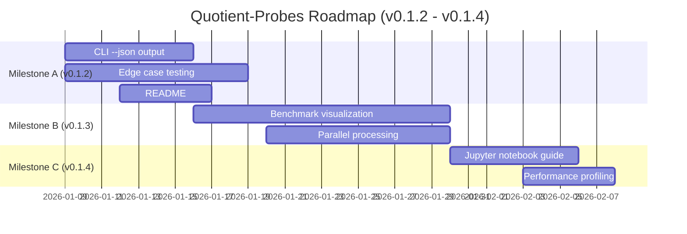

# Quotient-Probes Roadmap (v0.1.2 - v0.1.4)

## Phase 2: Operational Pack Execution

This roadmap tracks the implementation of features outlined in the PRD for releases v0.1.2 through v0.1.4.

## Milestone A: v0.1.2 (Jan 2026)
**Theme**: Developer Experience & Edge Cases

- **M1**: CLI `--json` output format for programmatic use
- **M2**: Edge case testing (empty arrays, single-element, all-equal)
- **M3**: README section: "Which symmetry test to pick?"

## Milestone B: v0.1.3 (Jan-Feb 2026)
**Theme**: Performance & Visualization

- **M4**: Benchmark visualization (charts for runtime comparison)
- **M5**: Parallel processing for large datasets

## Milestone C: v0.1.4 (Feb 2026)
**Theme**: Documentation & Optimization

- **M6**: Jupyter notebook tutorial with real-world examples
- **M7**: Performance profiling and optimization

---

## Release Cadence
- **v0.1.2**: ~2 weeks (early Feb 2026)
- **v0.1.3**: ~3 weeks (late Feb 2026)
- **v0.1.4**: ~2 weeks (mid Mar 2026)

See `RELEASE-NOTES-v0.1.x.md` for detailed release planning.
